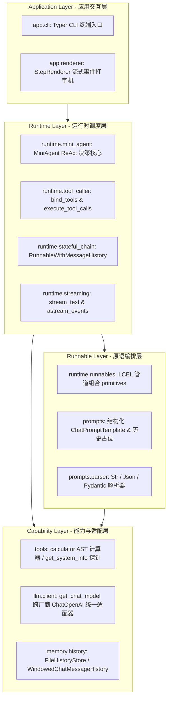

# AgentFlow

<p align="center">
  <b>简体中文</b> | <a href="README_en.md">English</a>
</p>

> 基于 LangChain LCEL 核心原语构建的轻量级单智能体（Single-Agent）ReAct 运行时框架与工程参考实现。

[](https://www.python.org/)
[](https://python.langchain.com/)
[](https://github.com/astral-sh/uv)
[](https://docs.pytest.org/)

---

## 1. 项目简介（Overview）

### What is AgentFlow?
**AgentFlow** 是一个以现代软件工程标准打造的轻量级单智能体（Single-Agent）ReAct 运行时工程。它以 LangChain 表达式语言（LCEL）与 `Runnable` 协议为基础，实现了具备思考推理（Thought）、工具动态调用（Tool Calling）、打字机流式输出（Streaming）与会话记忆隔离（Session Memory）的端到端 Agent 闭环。

### Why does it exist?
在构建生产级 Agent 系统的过程中，开发者常面临自研底层 Runtime 维护成本高（协议碎片化、流式中断、缺乏类型安全）与过早引入复杂状态图框架导致认知负荷过载的双重困境。  
AgentFlow 的使命是：**在不引入重量级图引擎（如 LangGraph）的前提下，系统化验证如何利用 LCEL 核心原语构建工业级、高可观测且边界清晰的 Agent 基础运行时**，为后续向复杂多智能体协同平滑演进建立坚实的工程底座。

---

## 2. 核心特性（Features）

项目现已完成全部 V0~V2 核心能力构建，并通过 43 项自动化单元与集成测试验证：

- ⚡ **纯 LCEL 管道编排**：基于统一的 `Runnable` 协议与操作符（`|`），提供串行（`compose_sequence`）、并行（`compose_parallel`）与上下文直通（`assign_context`）机制。
- 🤖 **MiniAgent ReAct 决策闭环**：单步决策由 LCEL 模型管道驱动，外层轻量控制环提供最大迭代步数（`max_iterations`）防死锁熔断保护。
- 🧠 **双模态思考流捕获**：原生提取 DeepSeek `reasoning_content` 推理流，自适应捕获模型在工具调用前的前置自然语言规划（Thought），实现终端即时反馈（<0.3s）。
- 🛠️ **强类型工具契约与安全沙箱**：基于 `@tool` 与 Pydantic Schema 自动生成 Function Calling 规范；内置基于 AST 递归求值的安全数学计算器（杜绝动态 `eval` 隐患）与宿主环境探针。
- 🌊 **低延迟打字机流式响应**：独创流式自适应缓冲算法，智能判别首字是“文本回答”还是“工具调用意图”，结合 `StepRenderer` 实现终端打字机流式穿透。
- 💾 **无状态状态外置与持久化会话**：通过 `session_id` 实现多会话完全隔离，提供内存滑动窗口截断（`WindowedChatMessageHistory`）与本地 JSON 文件持久化（`FileHistoryStore`）。
- 🖥️ **交互式 CLI 客户端**：基于 Typer 与 Rich 构建，支持单次提问（`ask`）、多轮持续交互对话（`chat`）与工具列表查看（`tools`）。
- 🧪 **100% 离线自动化测试门禁**：通过 Mock 与 Scripted 模型隔离外部网络开销，43 项 pytest 单元/集成测试全绿通过。

---

## 3. 系统架构（Architecture）

AgentFlow 遵循单向依赖分层架构与纯函数式无状态原则：



---

## 4. 核心概念（Core Concepts）

- **MiniAgent**：紧凑型 ReAct 智能体，负责单轮会话中“思考 $\to$ 决策动作 $\to$ 执行工具 $\to$ 观察反馈 $\to$ 总结答案”的闭环调度。
- **Runnable 统一协议**：LangChain 核心抽象，统一暴露 `invoke`、`batch`、`stream`、`ainvoke`、`astream` 契约，支持 Unix 管道式声明式组合。
- **Tool 契约沙箱**：基于 Pydantic 的自描述工具，具备入参类型防御，执行异常被包装为 `ToolMessage(status="error")` 供模型自我修复。
- **FileHistoryStore**：本地 JSON 存储管理器（存储于 `.sessions/{session_id}.json`），提供跨命令调用的持久会话支持与滑动窗口裁剪。
- **StepRenderer**：终端输出渲染引擎，负责将底层的 `AgentStep`（Thought, ToolCall, Observation, Token, FinalAnswer）解析为美观的终端交互流。

---

## 5. 项目目录结构（Project Structure）

```text
AgentFlow/
├── app/                  # 终端应用交互层 (Typer CLI, 格式化渲染器)
│   ├── cli.py            # CLI 命令定义: ask, chat, tools
│   ├── main.py           # Typer 入口与包分发
│   └── renderer.py       # StepRenderer 打字机与事件着色器
├── runtime/              # 运行时核心调度层 (MiniAgent, LCEL 组合, 工具分发)
│   ├── mini_agent.py     # MiniAgent ReAct 主循环与熔断控制
│   ├── runnables.py      # LCEL 纯函数管道原语 (sequence, parallel)
│   ├── stateful_chain.py # 带状态 RunnableWithMessageHistory 包装
│   ├── streaming.py      # 文本与结构化事件流式生成器
│   └── tool_caller.py    # 模型工具绑定与安全执行分发
├── llm/                  # 模型适配层 (OpenAI / DeepSeek / Ollama 统一接口)
│   └── client.py         # get_chat_model 统一工厂函数
├── prompts/              # 结构化提示词与输出解析层
│   ├── templates.py      # ChatPromptTemplate 与 MessagesPlaceholder 工厂
│   └── parser.py         # 字符串、JSON 与 Pydantic 强类型解析器
├── tools/                # 标准化工具层 (BaseTool / @tool)
│   ├── calculator.py     # 基于 AST 抽象语法树的安全数学计算器
│   └── system.py         # 宿主系统环境与 Python 运行时探针
├── memory/               # 会话状态持久化与记忆层
│   └── history.py        # 内存滑动窗口与本地 JSON 文件持久化 Store
├── docs/                 # 完整工程架构、设计规范与 ADR 决策文档体系
├── tests/                # 43 项自动化单元与集成测试套件
├── pyproject.toml        # 依赖与工程元数据配置
├── .env.example          # 环境变量配置模板
└── uv.lock               # 跨平台依赖锁定文件
```

---

## 6. 快速开始（Getting Started）

### 6.1 环境要求
- **Python**：`>= 3.12`
- **包管理器推荐**：[`uv`](https://github.com/astral-sh/uv)

### 6.2 安装步骤

```bash
# 1. 克隆代码仓库
git clone <repository_url>
cd AgentFlow

# 2. 安装依赖并同步虚拟环境
uv sync

# 3. 创建环境变量配置文件
cp .env.example .env    # Linux / macOS
# 或者 Windows:
# Copy-Item .env.example .env
```

### 6.3 配置环境变量
编辑 `.env` 文件，填入模型 API 密钥：

```dotenv
OPENAI_API_KEY=your_actual_api_key_here
OPENAI_BASE_URL=https://api.openai.com/v1     # 支持 DeepSeek / Ollama / 代理
OPENAI_MODEL_NAME=gpt-4o-mini                # 默认模型名称
```

### 6.4 运行 CLI 命令

```bash
# 1. 查看可用工具列表
uv run python -m app tools

# 2. 单次提问（自动调用工具、流式输出）
uv run python -m app ask "计算 (123 * 45) + 678 并查看当前运行环境"

# 3. 指定会话 ID 体验持久化上下文记忆
uv run python -m app ask "你好，我是工程师张三" --session-id user_01
uv run python -m app ask "请问我的名字叫什么？" --session-id user_01

# 4. 启动交互式多轮 Agent 终端会话
uv run python -m app chat --session-id test_chat
```

### 6.5 运行自动化测试

```bash
# 执行全量 43 项测试套件
uv run pytest
```

---

## 7. 开发与质量门禁（Development）

```bash
# 运行单元测试
uv run pytest

# 运行静态代码检查
uv run ruff check

# 检查代码格式
uv run black --check .
```

更多开发规范、代码质量要求与架构约束请参阅 [开发者指南](file:///d:/myProject/AgentFlow/docs/development/development-guide.md)。

---

## 8. 文档导航（Documentation Index）

AgentFlow 建立了完备的架构与设计文档体系：

```text
docs/
├── architecture/                     # 架构设计与机制映射
│   ├── system-architecture.md        # 分层架构、数据流与边界规范
│   └── migration-map.md              # 自研 Runtime 到 LangChain LCEL 全量映射手册
├── design/                           # 核心组件专项设计
│   ├── mini-agent.md                 # MiniAgent ReAct 决策循环与流式缓冲设计
│   └── tools-and-memory.md           # 工具沙箱与文件会话持久化设计
├── development/                      # 开发者指引与工程规范
│   └── development-guide.md          # 环境搭建、配置、测试与编码门禁
├── adr/                              # 架构决策记录 (ADR)
│   ├── ADR-001-why-langchain.md      # ADR-001: 为什么选择 LangChain LCEL 作为标杆
│   ├── ADR-002-runnable-first.md     # ADR-002: 为什么将 Runnable 确立为第一攻坚目标
│   ├── ADR-003-no-langgraph-yet.md   # ADR-003: 为什么暂不引入 LangGraph
│   └── ADR-004-session-file-memory.md# ADR-004: 为什么单智能体阶段采用本地 JSON 文件记忆
└── roadmap/                          # 演进与研发规划
    └── roadmap.md                    # 9 阶段已交付详情与后续 V3 路线图
```

---

## 9. 路线图概览（Roadmap Summary）

| 阶段 | 状态 | 核心交付 |
| :--- | :--- | :--- |
| **V0 Foundation (Phase 0~2)** | ✅ **已完成** | 架构设计门禁、工程分层骨架、现代工具链（uv, ruff, pytest） |
| **V1 LangChain Core (Phase 3~5)** | ✅ **已完成** | LCEL 核心原语、结构化 Prompt/Parser、BaseTool 动态绑定与 AST 计算器 |
| **V2 Agent Capability (Phase 6~8)** | ✅ **已完成** | 打字机流式响应、文件会话记忆隔离、MiniAgent ReAct 闭环与 CLI 交互 |
| **V3 StateGraph & Scaling (Phase 9~13)** | 📋 **规划中** | LangGraph 状态图集成、多智能体协作（Multi-Agent）、RAG 知识检索、MCP 协议、FastAPI 服务化 |

详细实施规划与各阶段质量门禁请参考 [研发路线图](file:///d:/myProject/AgentFlow/docs/roadmap/roadmap.md)。

---

## 10. 关于工程元数据（Metadata Note）

项目正式更名为 **AgentFlow**。为保持现有迁移演进与命令行习惯的向前兼容，代码包与 CLI 脚本元数据（如 `pyproject.toml` 中的 `jarvis = "app.main:run"`）暂时保留兼容别名，推荐使用 `uv run python -m app <command>` 或 `uv run jarvis <command>` 执行。
