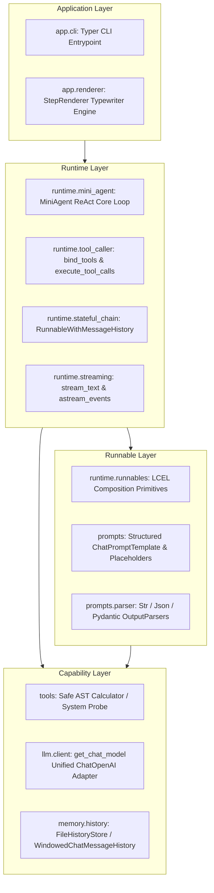

# AgentFlow

<p align="center">
  <a href="README.md">简体中文</a> | <b>English</b>
</p>

> A lightweight Single-Agent ReAct runtime framework and engineering reference implementation built on LangChain LCEL core primitives.

[](https://www.python.org/)
[](https://python.langchain.com/)
[](https://github.com/astral-sh/uv)
[](https://docs.pytest.org/)

---

## 1. Overview

### What is AgentFlow?
**AgentFlow** is a lightweight Single-Agent ReAct runtime engineering project built according to modern software engineering standards. Centered around the LangChain Expression Language (LCEL) and the `Runnable` protocol, it realizes an end-to-end agent loop featuring reasoning thought capture, dynamic tool calling, typewriter token streaming, and session-isolated persistent memory.

### Why does it exist?
When engineering production-grade Agent systems, developers frequently face two extremes:
1. **High maintenance overhead of custom runtimes**: Fragmented model APIs, fragile streaming handlers, manual JSON parsing, and lack of type contracts.
2. **Premature complexity from heavy graph engines**: Introducing complex state graph frameworks (like LangGraph) too early causes cognitive overload before mastering underlying data flows.

AgentFlow's mission: **Systematically validate how to construct an industrial-grade, highly observable, and cleanly bounded single-agent foundation using pure LCEL core primitives without introducing heavy graph frameworks**, establishing a solid engineering bedrock before advancing to complex multi-agent orchestration.

---

## 2. Core Features

The project has completed all V0~V2 milestones, verified with 43 automated unit and integration tests:

- ⚡ **Pure LCEL Pipeline Composition**: Declarative chaining via the standard `Runnable` protocol and pipe operator (`|`), providing sequential (`compose_sequence`), parallel (`compose_parallel`), and passthrough assignment (`assign_context`) primitives.
- 🤖 **MiniAgent ReAct Decision Loop**: Single-step reasoning driven by the LCEL model pipeline, with an outer lightweight control loop enforcing max iteration protection (`max_iterations`) to prevent infinite execution loops.
- 🧠 **Dual-Mode Thought Capture**: Native extraction of DeepSeek `reasoning_content` streams and adaptive preamble thought extraction prior to tool calls, delivering instant visual feedback in terminal (<0.3s).
- 🛠️ **Strict Tool Contracts & Safe Sandbox**: Automatic OpenAI Function Calling schema generation via `@tool` and Pydantic models. Includes a secure AST-based mathematical evaluator (preventing arbitrary code execution) and host environment diagnostic probes.
- 🌊 **Low-Latency Typewriter Token Streaming**: Dynamic adaptive buffering that distinguishes whether an initial chunk is standard text or an impending tool call, combined with `StepRenderer` for smooth terminal streaming.
- 💾 **Stateless Core with Persistent Session Memory**: Complete multi-session isolation driven by `session_id`, supporting in-memory sliding window truncation (`WindowedChatMessageHistory`) and file-backed JSON persistence (`FileHistoryStore`).
- 🖥️ **Interactive Terminal CLI**: Built with Typer and Rich, supporting single-turn queries (`ask`), interactive multi-turn REPL chat (`chat`), and registered tool discovery (`tools`).
- 🧪 **100% Offline Automated Test Gate**: Mock and scripted models isolate external network calls, ensuring all 43 pytest unit/integration tests pass reliably in offline environments.

---

## 3. System Architecture

AgentFlow adheres to a strict single-directional layered architecture and pure functional statelessness:



---

## 4. Core Concepts

- **MiniAgent**: Compact ReAct agent orchestrating the reasoning loop: Thought $\to$ Action $\to$ Execution $\to$ Observation $\to$ Synthesis.
- **Runnable Unified Protocol**: The central LangChain abstraction providing unified `invoke`, `batch`, `stream`, `ainvoke`, and `astream` contracts with Unix pipe-like composition.
- **Tool Contract Sandbox**: Self-describing tools built on Pydantic schemas; runtime exceptions are safely caught and returned as `ToolMessage(status="error")` for self-correction.
- **FileHistoryStore**: Local JSON storage manager (`.sessions/{session_id}.json`) offering session persistence across CLI invocations with sliding window truncation.
- **StepRenderer**: Rich terminal renderer converting low-level `AgentStep` events (Thought, ToolCall, Observation, Token, FinalAnswer) into an intuitive visual stream.

---

## 5. Project Structure

```text
AgentFlow/
├── app/                  # Application & presentation layer (Typer CLI, formatting renderer)
│   ├── cli.py            # CLI commands: ask, chat, tools
│   ├── main.py           # Typer entrypoint & package distribution
│   └── renderer.py       # StepRenderer typewriter and event styler
├── runtime/              # Runtime orchestration layer (MiniAgent, LCEL pipelines, tool dispatch)
│   ├── mini_agent.py     # MiniAgent ReAct loop & deadlock guard
│   ├── runnables.py      # LCEL pure functional primitives (sequence, parallel)
│   ├── stateful_chain.py # Stateful RunnableWithMessageHistory wrapper
│   ├── streaming.py      # Text & structured event streaming generators
│   └── tool_caller.py    # Model tool binding & execution dispatch
├── llm/                  # Model adapter layer (OpenAI / DeepSeek / Ollama unified interface)
│   └── client.py         # get_chat_model factory function
├── prompts/              # Structured prompt engineering & output parsing
│   ├── templates.py      # ChatPromptTemplate & MessagesPlaceholder factories
│   └── parser.py         # String, JSON & Pydantic output parsers
├── tools/                # Standardized tool definitions (BaseTool / @tool)
│   ├── calculator.py     # Safe math evaluator via Python AST parsing
│   └── system.py         # Host system and runtime environment probe
├── memory/               # Session state persistence & chat history
│   └── history.py        # In-memory sliding window & JSON file history store
├── docs/                 # System architecture, design docs, ADRs & roadmap
├── tests/                # 43 automated unit and integration tests
├── pyproject.toml        # Dependencies and project metadata configuration
├── .env.example          # Environment configuration template
└── uv.lock               # Cross-platform dependency lockfile
```

---

## 6. Getting Started

### 6.1 Prerequisites
- **Python**: `>= 3.12`
- **Recommended Package Manager**: [`uv`](https://github.com/astral-sh/uv)

### 6.2 Installation

```bash
# 1. Clone repository
git clone <repository_url>
cd AgentFlow

# 2. Sync dependencies and create virtual environment
uv sync

# 3. Create environment configuration file
cp .env.example .env    # Linux / macOS
# Or on Windows:
# Copy-Item .env.example .env
```

### 6.3 Configuration
Edit `.env` to configure your LLM credentials:

```dotenv
OPENAI_API_KEY=your_actual_api_key_here
OPENAI_BASE_URL=https://api.openai.com/v1     # Supports DeepSeek / Ollama / Proxies
OPENAI_MODEL_NAME=gpt-4o-mini                # Default model name
```

### 6.4 CLI Usage

```bash
# 1. Discover registered tools
uv run python -m app tools

# 2. Single-turn query (automatic tool calling with streaming tokens)
uv run python -m app ask "Calculate (123 * 45) + 678 and report the host system"

# 3. Persistent conversation memory with custom session ID
uv run python -m app ask "Hi, my name is Alice" --session-id user_01
uv run python -m app ask "What is my name?" --session-id user_01

# 4. Interactive multi-turn REPL chat session
uv run python -m app chat --session-id test_chat
```

### 6.5 Running Tests

```bash
# Run the complete test suite (43 passed tests)
uv run pytest
```

---

## 7. Development & Quality Gates

```bash
# Run unit tests
uv run pytest

# Run static linter
uv run ruff check

# Verify code formatting
uv run black --check .
```

For detailed coding standards and architectural rules, see the [Development Guide](file:///d:/myProject/AgentFlow/docs/development/development-guide.md).

---

## 8. Documentation Index

AgentFlow maintains a comprehensive documentation structure:

```text
docs/
├── architecture/                     # Architecture & migration analysis
│   ├── system-architecture.md        # 6-layer architecture, data flow & boundary rules
│   └── migration-map.md              # Custom runtime vs LangChain LCEL mapping matrix
├── design/                           # Component-level design specifications
│   ├── mini-agent.md                 # MiniAgent ReAct loop & streaming buffer design
│   └── tools-and-memory.md           # Tool sandboxing & session file persistence
├── development/                      # Developer guide & engineering rules
│   └── development-guide.md          # Setup, configuration, CLI usage, tests & quality gates
├── adr/                              # Architecture Decision Records (ADRs)
│   ├── ADR-001-why-langchain.md      # ADR-001: Why choose LangChain LCEL as the reference
│   ├── ADR-002-runnable-first.md     # ADR-002: Why prioritize Runnable primitives
│   ├── ADR-003-no-langgraph-yet.md   # ADR-003: Why defer LangGraph to subsequent phases
│   └── ADR-004-session-file-memory.md# ADR-004: Why use local JSON file storage for memory
└── roadmap/                          # Roadmap & evolutionary milestones
    └── roadmap.md                    # Detailed deliverables for Phase 0-8 & V3 planning
```

---

## 9. Roadmap Summary

| Version / Milestone | Status | Key Deliverables |
| :--- | :--- | :--- |
| **V0 Foundation (Phase 0~2)** | ✅ **Completed** | Architecture design gate, modular skeleton, modern toolchain (uv, ruff, pytest) |
| **V1 LangChain Core (Phase 3~5)** | ✅ **Completed** | LCEL primitives, structured Prompt/Parser, BaseTool dynamic binding, safe AST calculator |
| **V2 Agent Capability (Phase 6~8)** | ✅ **Completed** | Typewriter streaming, session file persistence, MiniAgent ReAct loop, Typer CLI |
| **V3 StateGraph & Scaling (Phase 9~13)** | 📋 **Planned** | LangGraph StateGraph, Multi-Agent collaboration, RAG retrieval, MCP integration, FastAPI service |

For detailed phased roadmaps and quality gates, please refer to the [Roadmap](file:///d:/myProject/AgentFlow/docs/roadmap/roadmap.md).

---

## 10. Metadata Note

The project is officially named **AgentFlow**. To preserve backward compatibility during the reference migration phase, package metadata and console entrypoints (such as `jarvis = "app.main:run"` in `pyproject.toml`) retain the alias. Running via `uv run python -m app <command>` or `uv run jarvis <command>` is fully supported.
