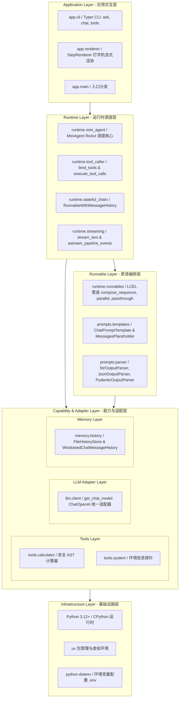
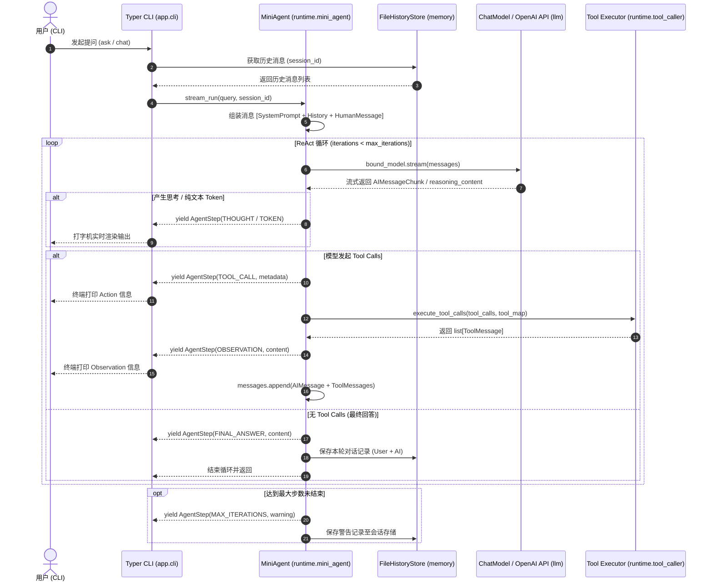

# AgentFlow 系统架构设计说明书（System Architecture）

> **系统定位**：基于 LangChain LCEL 核心原语构建的高内聚、低耦合单智能体（Single-Agent）ReAct 运行时框架与工程参考实现。  
> **核心原则**：纯函数式管道编排、分层解耦、统一协议契约、状态外置持久化。

---

## 1. 架构总览（System Architecture Overview）

AgentFlow 采用严格的单向依赖分层架构，自顶向下分为六层：

---

## 2. 各层职责与边界约束（Layer Responsibilities & Boundaries）

### 2.1 Application Layer（应用接入层）
- **对应模块**：`app/cli.py`, `app/renderer.py`, `app/main.py`
- **核心职责**：
  - 提供基于 Typer 的命令行交互能力，包含单次问答（`ask`）、多轮交互会话（`chat`）与工具探查（`tools`）；
  - `StepRenderer` 消费底层产出的 `AgentStep` 事件流，实现低延迟打字机流式输出、中间 Thought 呈现与工具调用观测可视化。
- **边界约束**：严格依赖 Runtime Layer 暴露的标准化执行接口（`MiniAgent.stream_run()`），**严禁直接越级操作底层 LLM 或 Tools**。

### 2.2 LangChain Runtime Layer（智能体运行时层）
- **对应模块**：`runtime/mini_agent.py`, `runtime/tool_caller.py`, `runtime/stateful_chain.py`, `runtime/streaming.py`
- **核心职责**：
  - `MiniAgent`：调度 ReAct 决策主循环（Thought $\to$ Tool Call $\to$ Observation $\to$ Final Answer）；
  - 控制循环最大迭代深度（`max_iterations`，默认 5 步）以实现防死循环熔断；
  - 动态捕获模型思考流（支持 DeepSeek `reasoning_content` 及工具调用前置推理）；
  - 管理工具模型绑定（`bind_model_tools`）与工具执行回传（`execute_tool_calls`）；
  - 挂载会话历史，通过 `session_id` 实现多租户级无状态隔离。
- **边界约束**：通过 LCEL 标准管道驱动模型，工具调用结果统一包装为 `ToolMessage` 注入上下文。

### 2.3 Runnable Layer（核心原语编排层）
- **对应模块**：`runtime/runnables.py`, `prompts/templates.py`, `prompts/parser.py`
- **核心职责**：
  - 基于 LCEL 构建纯函数式调用链（`|` 管道操作符）；
  - 提供 `compose_sequence`（串行）、`compose_parallel`（并行）与 `assign_context`（直通注入）；
  - 结构化强类型提示词生成（`create_chat_prompt`）与动态历史占位注入；
  - 输出结果解析与 Pydantic 强类型模型校验（`PydanticOutputParser`）。
- **边界约束**：保持纯函数性与不可变性，链本身不持有任何局部执行状态。

### 2.4 Capability & Adapter Layer（能力与适配层）
- **Tools Layer (`tools/`)**：
  - 统一使用 `@tool` 装饰器与 Pydantic `BaseModel` 声明入参 Schema；
  - 异常通过 `ToolMessage(status="error")` 安全回传，杜绝未捕获异常导致 Agent 崩溃。
- **LLM Adapter Layer (`llm/`)**：
  - `get_chat_model()` 封装 OpenAI API 兼容层（支持 OpenAI、DeepSeek、Moonshot、本地 Ollama）；
  - 屏蔽不同厂商的协议细节，统一输出 LangChain 标准 `BaseChatModel`。
- **Memory Layer (`memory/`)**：
  - 实现基于内存的 `WindowedChatMessageHistory` 与基于本地 JSON 文件的 `FileChatMessageHistory`；
  - 采用滑动窗口截断（`max_messages`）防止上下文超出模型最大 Token 上限。

### 2.5 Infrastructure Layer（基础设施层）
- **运行时环境**：Python 3.12+；
- **构建与包管理**：`uv`、`hatchling`；
- **网络与配置**：`httpx`、`python-dotenv`。

---

## 3. 核心数据流与执行时序（Data Flow & Sequence）

### 3.1 MiniAgent ReAct 决策循环时序

在多轮工具调用场景下，从用户输入到最终回答的时序流转如下：

---

## 4. 核心系统边界（Architectural Boundaries）

| 概念 | 归属边界 | 核心职责 | 当前实现方案 |
| :--- | :--- | :--- | :--- |
| **Agent** | 决策实体 | 维持 ReAct 状态循环与决策判断 | `MiniAgent` |
| **Runtime** | 执行骨架 | LCEL 消息流转、工具调度与熔断拦截 | `runtime.mini_agent` + `runtime.tool_caller` |
| **LLM** | 智能中枢 | 纯推理与 Function Calling 结构化输出 | `ChatOpenAI` 兼容层 (`llm.client`) |
| **Tool** | 确定性动作 | 提供明确入参 Schema 与隔离执行的能力 | `@tool` 装饰器 + Pydantic Schema |
| **Memory** | 会话持久化 | 会话隔离、滑动截断与持久化存储 | `FileHistoryStore` (`.sessions/{session_id}.json`) |
| **Gateway** | 接入分发 | 服务化暴露与网络接入 | **暂未实现**（当前仅有 Typer CLI） |
| **RAG** | 知识检索 | 文档向量化与召回增强 | **暂未实现**（规划在后续演进） |
| **MCP** | 远程工具协议 | Model Context Protocol 远程工具发现 | **暂未实现**（规划在后续演进） |

---

## 5. 架构设计原则与约束（Architectural Constraints）

1. **LCEL 函数式纯净性**：所有 LCEL 管道必须保持为纯函数式无状态对象，任何会话状态通过外部 `session_id` 显式驱动。
2. **单向分层依赖**：严禁逆向依赖或循环导入（如 `tools` 模块禁止引用 `runtime` 或 `app`；`llm` 模块禁止引用 `memory`）。
3. **强类型与防御性执行**：
   - 所有的 Tool 必须由 Pydantic 模型严格校验入参；
   - 工具内部异常必须就地捕获并封装为 `ToolMessage(status="error")`，确保 ReAct 循环具备自我修复能力。
4. **渐进式演化隔离**：当前单智能体阶段严格坚守 **“不引入 LangGraph”** 的红线（详见 [ADR-003](file:///d:/myProject/AgentFlow/docs/adr/ADR-003-no-langgraph-yet.md)），在彻底掌握 LCEL 核心原语后，再向状态图与多智能体平滑演进。
