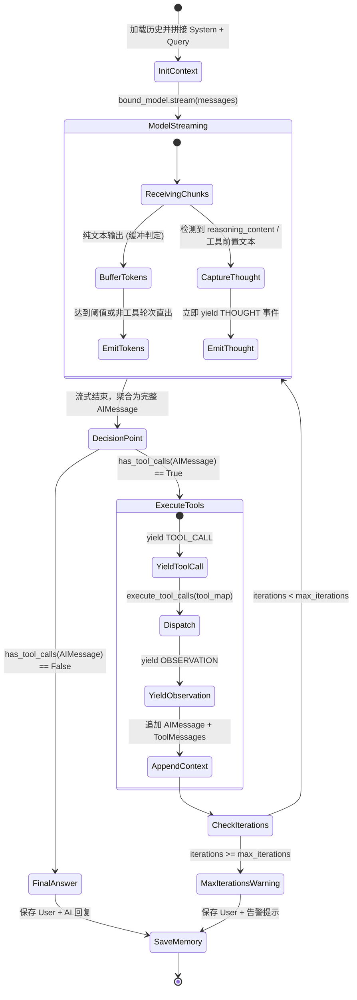

# MiniAgent 运行时设计文档（MiniAgent Runtime Design）

> **设计定位**：纯 LCEL 驱动的轻量级 ReAct 循环调度器，集工具动态绑定、低延迟流式反馈、双模态思考捕获与死锁熔断于一体。  
> **代码依据**：[`runtime/mini_agent.py`](file:///d:/myProject/AgentFlow/runtime/mini_agent.py), [`app/renderer.py`](file:///d:/myProject/AgentFlow/app/renderer.py)

---

## 1. 核心设计动机与边界

在进入重型状态机（如 LangGraph）之前，AgentFlow 探索了使用 LangChain LCEL 核心原语能够达到的单智能体调度极限：
1. **纯 LCEL 驱动决策**：模型与工具通过 `model.bind_tools(tools)` 声明式绑定，形成单一无状态的决策节点；
2. **轻量控制环驱动状态**：外层通过受控的 `while` 循环推进状态演化，并在每一步派发标准化的生命周期事件；
3. **保留向状态图演进的切面**：将单步决策与多步调度清晰分离，未来迁移到 `StateGraph` 时决策链路可直接作为图节点（Node）复用。

---

## 2. 状态机与执行时序（ReAct Cycle）

`MiniAgent` 的单轮会话内部状态机流转如下：



---

## 3. 关键机制深度剖析

### 3.1 双模态思考捕获（Dual-Mode Thought Capture）

为了在终端和 UI 上给用户提供即时可见的思考反馈（<0.3s），`MiniAgent` 支持两种思考捕获路径：
1. **原生推理流（Native Reasoning Content）**：
   - 适配 DeepSeek-R1 / OpenAI o-series 等推理模型；
   - 实时从 `chunk.additional_kwargs.get("reasoning_content")` 中提取增量 Token 并暂存；
   - 一旦触发工具调用或流式结束，立即将其派发为 `AgentStepType.THOUGHT`。
2. **前置自然语言思考（Preamble Thought Extraction）**：
   - 当模型在调用工具前输出了自然语言规划（如“我需要计算 12 * 12，让我调用计算器”），若检测到紧随其后的 `tool_calls`，立即将前序缓冲文本升格为 `THOUGHT` 事件，防止被当成最终答案混淆输出；
   - 若模型未输出任何思考文字即直发工具调用，系统自动生成合规描述（如“准备调用工具 calculator 执行任务”），确保交互轨迹的完整性。

### 3.2 动态流式缓冲策略（Token Streaming vs Buffer）

在多轮 ReAct 交互中，最大的交互矛盾是：**模型流式吐出几个字符时，我们无法预知该轮次是“直接回答”还是“准备调工具”**。

`MiniAgent` 采用动态自适应缓冲算法：
- **首次判断轮次**：设置 `buffer_char_limit = 100`。模型刚吐出前几十个字符时暂入 `token_buffer`；
  - 若在缓冲期间检测到 `tool_calls`，清空缓冲并将文本转化为 `THOUGHT`，**终端不会误打印任何半截回答**；
  - 若累积超过 100 字符仍无工具调用，认定为最终答案，将缓冲区排空并开启实时直流通行模式（`has_emitted_tokens = True`）；
- **工具回传合成轮次**：若当前上下文已包含 `ToolMessage`，表明模型正在根据工具结果生成最终回答，此时将 `buffer_char_limit` 设为 `0`，**直接享受零延迟打字机流式输出**。

### 3.3 事件抽象契约（AgentStep）

`MiniAgent.stream_run()` 统一产出 `AgentStep` 数据结构：

```python
class AgentStepType(StrEnum):
    THOUGHT = "thought"             # 模型思考过程 / 规划内容
    TOOL_CALL = "tool_call"         # 工具调用意图与入参元数据
    OBSERVATION = "observation"     # 工具实际执行返回值
    TOKEN = "token"                 # 最终答案的实时流式字符
    FINAL_ANSWER = "final_answer"   # 聚合后的完整最终回答
    MAX_ITERATIONS = "max_iterations" # 超出最大步数熔断告警
```

### 3.4 防死循环熔断保护（Max Iterations Protection）

为防止模型在某些复杂任务中陷入工具反复互调的死循环，`MiniAgent` 内置强制计数器：
- 默认 `max_iterations = 5`（可通过 CLI `--max-iterations` 自定义）；
- 一旦迭代步数耗尽，循环无条件中断，派发 `MAX_ITERATIONS` 告警事件；
- 该轮故障信息同样会被安全持久化进会话历史，便于排查诊断。

---

## 4. 接口协议遵循（Runnable Interface）

`MiniAgent` 完整实现了 LangChain 的 `Runnable[dict[str, Any] | str, str]` 协议：
- `invoke(input, config=None)`：同步运行，返回最终回答字符串；
- `stream(input, config=None)`：流式运行，产生 `AgentStep` 迭代器；
- 支持在 `config={"configurable": {"session_id": "xxx"}}` 中传递会话隔离标识。
